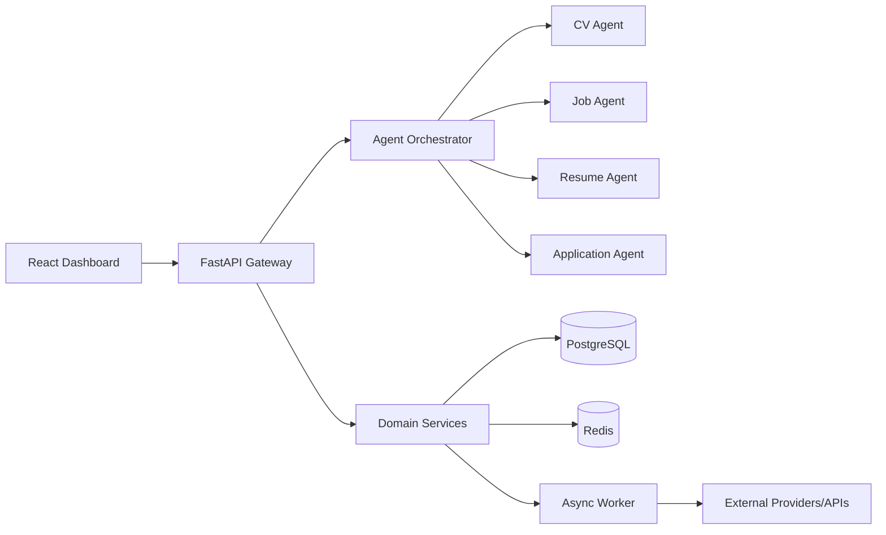

# System Architecture

## 1) Objectives

The platform is designed for high-confidence, human-supervised job search automation with strict factual integrity.

Primary goals:
- maximize interview conversion rate
- reduce repetitive application work
- keep recommendations explainable
- preserve user control over submission decisions

## 2) High-level Design

## 3) Backend Layers

### API Layer (`backend/app/api`)
- versioned endpoints (`/api/v1`)
- request/response schemas
- auth boundary and policy enforcement

### Domain Layer (`backend/app/services`)
- CV parsing and normalization
- job discovery abstraction and dedupe
- scoring and explainability
- resume and cover-letter generation pipelines

### Agent Layer (`backend/app/agents`)
- orchestrates specialized agents
- handles delegation, retries, confidence aggregation
- supports human approval checkpoints

### Persistence Layer (`backend/app/db`, `backend/app/repositories`)
- PostgreSQL as source of truth
- repository interfaces for candidate/job/application entities
- audit trails for generated artifacts and model decisions

### Async Layer (`backend/app/workers`)
- background fetch, enrichment, and batch generation jobs
- rate-limited provider sync
- scheduled re-ranking and feedback ingestion

## 4) Frontend Architecture

Frontend (`frontend/`) is a React SPA with:
- dashboard views for pipeline + insights
- recommendation review workflow
- human approval screens for generated documents and application steps
- query-driven state via TanStack Query

## 5) Data Architecture

Core entities:
- CandidateProfile
- CandidateSkill
- JobPosting
- JobMatchScore
- TailoredArtifact (resume/cover letter)
- Application
- FeedbackEvent

Storage rules:
- immutable snapshots for generated artifacts
- versioned scoring outputs for traceability
- source provenance per job posting and parsed data block

## 6) Security & Compliance

- no fabricated candidate data
- explicit provenance tagging for extracted and generated content
- PII encryption-at-rest strategy at DB column boundary (planned)
- secrets only from environment/secret manager
- approval gate before any final submit action

## 7) Operational Design

- health and readiness probes
- structured JSON logs with request IDs
- metrics hooks for key funnels: recommend -> apply -> interview
- scalable worker pool for burst ingestion and batch prep

## 8) Deployment Targets

- local: Docker Compose
- staging/prod: containerized backend + frontend + managed Postgres/Redis
- CI/CD: GitHub Actions baseline with lint/test/build gates

## 9) Extensibility

- provider adapters (LinkedIn, Indeed, SEEK, custom)
- LLM provider abstraction for generation/ranking
- pluggable vector index and embedding backends
- browser automation plugin layer for supervised application flows
